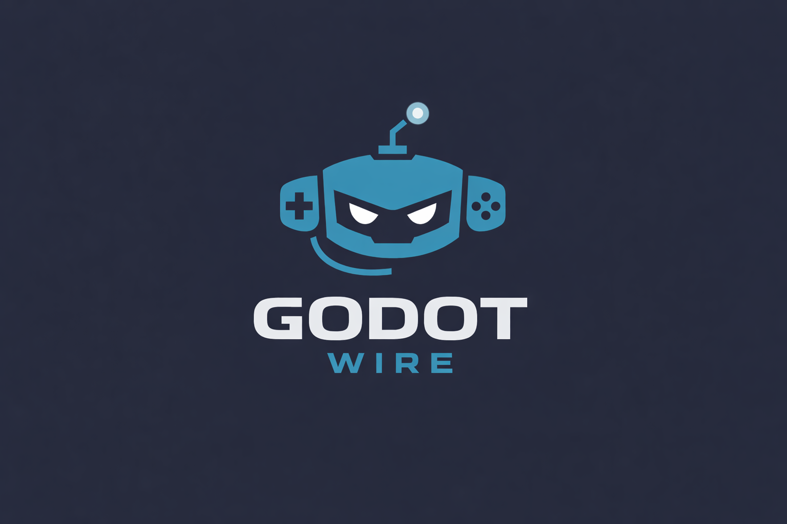

<p align="center">
  
</p>

<h1 align="center">GodotWire</h1>

<p align="center">MCP server for Godot Engine — wires AI to your editor and running game.</p>

## What is this?

GodotWire is a Godot 4.x editor plugin that implements the [Model Context Protocol (MCP)](https://modelcontextprotocol.io/) 2025 spec, allowing AI assistants (Claude, GPT, Copilot, etc.) to directly inspect and manipulate your Godot project.

**Key features:**
- **Streamable HTTP transport** (MCP 2025 standard) — single `/mcp` endpoint
- **Modular tool architecture** — drop a `.gd` file in `tools/` to add capabilities
- **28 tools** across 5 categories (scene, script, node, editor, file)
- **TCP game bridge** (planned) — sub-millisecond communication with running games

## Installation

1. Copy the `addons/godot_wire/` folder into your Godot project's `addons/` directory
2. In Godot, go to **Project → Project Settings → Plugins**
3. Enable **GodotWire**
4. The server starts automatically on `127.0.0.1:6500`

## MCP Client Configuration

### Claude Desktop / Copilot
Point your MCP client to: `http://127.0.0.1:6500/mcp`

The server uses **Streamable HTTP** — send JSON-RPC 2.0 POST requests to `/mcp`.

## Tools

| Module | Tools | Description |
|--------|-------|-------------|
| `scene_tools` | 12 | Scene tree, nodes, instantiation, node details, attach script |
| `script_tools` | 4 | Execute, create, edit, check errors |
| `node_tools` | 6 | Properties, methods, signals, batch |
| `editor_tools` | 10 | Screenshots, play/stop, selection, scene/project management |
| `file_tools` | 9 | Read, write, create, delete, rename, search, resources |
| `runtime_tools` | 8 | Game screenshots, scene tree, execute, input sim, props |
| `navigation_tools` | 3 | Nav regions, navmesh baking, nav agents |

**Total: 52 tools**

## Adding Custom Tools

Create a new `.gd` file in `addons/godot_wire/tools/`:

```gdscript
extends GodotWireTool

func get_tools() -> Array:
    return [
        {
            "name": "my_custom_tool",
            "description": "Does something cool",
            "inputSchema": {
                "type": "object",
                "properties": {
                    "arg1": {"type": "string", "description": "An argument"}
                },
                "required": ["arg1"]
            }
        }
    ]

func call_tool(tool_name: String, args: Dictionary) -> Dictionary:
    match tool_name:
        "my_custom_tool":
            return _success("It worked!")
    return _error("Unknown tool")
```

The tool is auto-discovered on plugin load. No registration needed.

## Architecture

```
MCP Client (Claude, Copilot, etc.)
    ↓ POST /mcp (JSON-RPC 2.0)
server.gd (Streamable HTTP on port 6500)
    ↓
protocol.gd (MCP 2025-03-26 spec)
    ↓
tool_registry.gd (auto-discovers modules)
    ↓
tools/*.gd (modular tool implementations)
```

## Requirements

- Godot 4.4+
- Localhost only (127.0.0.1) — not exposed to network

## License

MIT
